# Rend-a-Pixel (Raytracer)

**Rend-a-Pixel** is a raytracing rendering engine developed on top of the **Lightwave** Framework as the final project for the [Computer Graphics course at Saarland University](https://graphics.cg.uni-saarland.de/) lectured by [Prof. Dr.-Ing. Philipp Slusallek](https://graphics.cg.uni-saarland.de/people/slusallek.html) during the Winter Semester 2023/2024. Some of the implemented features are showcased below:

## Area Lights 

<table>
<tr>
  <td align="center">No Area Lights</td>
  <td align="center">Uniform Sphere Sampling</td>
</tr>
<tr>
    <td>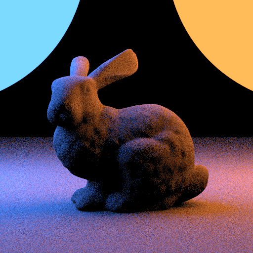
    <td>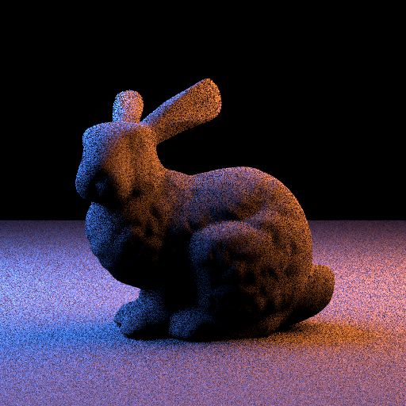
</tr>
  <tr>
  <td align="center">Cosine-Weighted Sampling</td>
  <td align="center">Subtended-Cone Sampling</td>
</tr>
<tr>
    <td>
    <td>
</tr>
</table>

## Multiple Importance Sampling

<table>
<tr>
  <td align="center">BSDF Sampling</td>
  <td align="center">NEE</td>
  <td align="center">MIS</td>
</tr>
<tr>
  <td>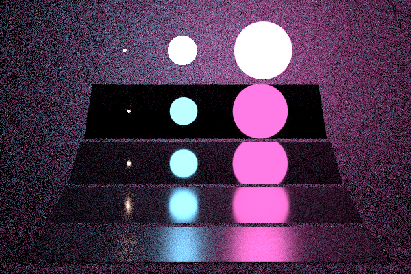
  <td>
  <td>
</tr>
</table>

## Shading Normals

<table>
<tr>
  <td align="center">No Normal Mapping</td>
  <td align="center">Normal Mapping</td>
</tr>
<tr>
    <td>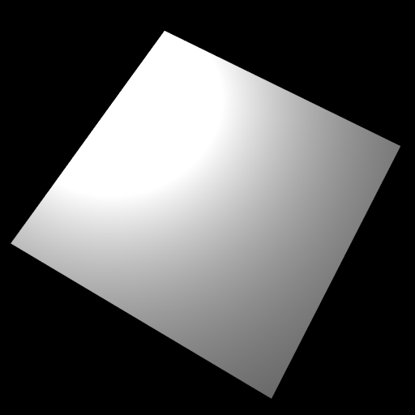
    <td>
</tr>
</table>

## A Thinlens Camera Model

<table>
<tr>
  <td align="center">Perspective</td>
  <td align="center">With Thinlens</td>
</tr>
<tr>
    <td>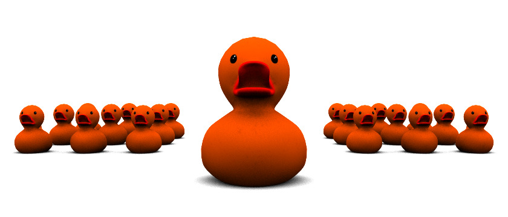
    <td>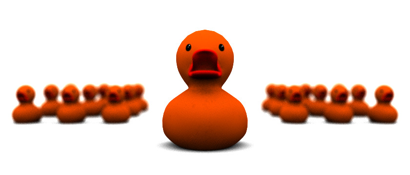
</tr>
</table>

## Alpha Masking

<table>
<tr>
  <td align="center">Without Alpha Masking</td>
  <td align="center">With Alpha Masking</td>
</tr>
<tr>
    <td>
    <td>
</tr>
</table>

## Custom Bokeh Shapes

<table>
<tr>
  <td align="center">Sphere-looking Lights</td>
  <td align="center">3-bladed Bokeh Shapes</td>
</tr>
<tr>
    <td>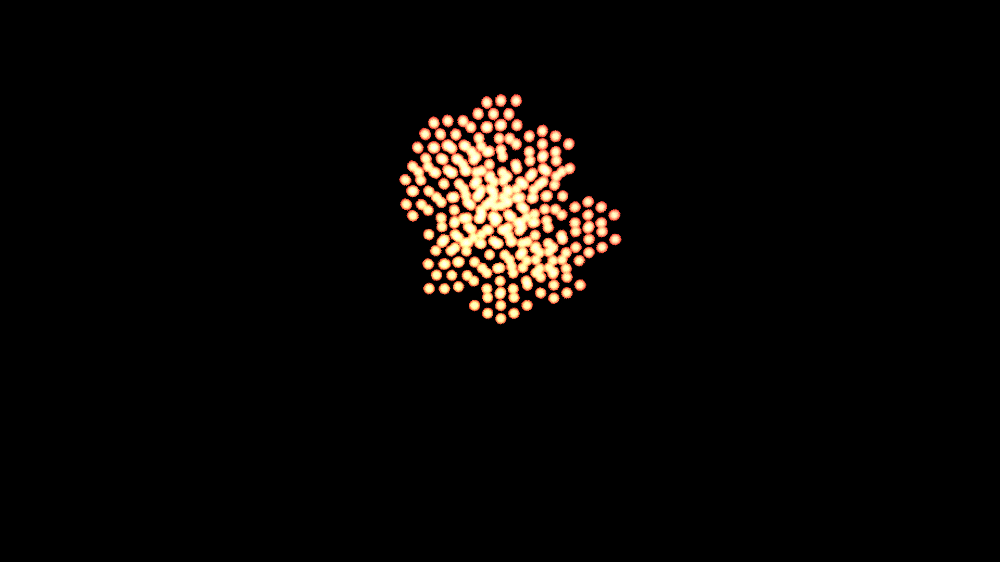
    <td>
</tr>
</table>

## Image Denoising

  <table width="100%">
    <tr>
      <td align="center">Noisy</td>
      <td align="center">Denoised</td>
    </tr>
    <tr>
        <td>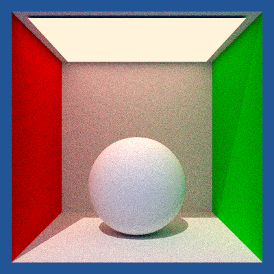
        <td>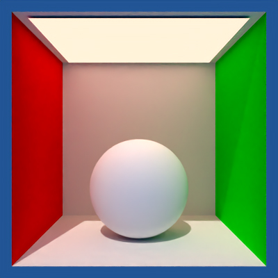
    </tr>
  </table>

## Halton Sampler

<table>
<tr>
  <td align="center">Independent Sampling</td>
  <td align="center">Normal Halton Sampling</td>
</tr>
<tr>
    <td>
    <td>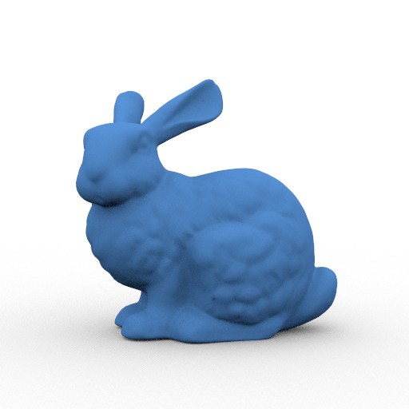
</tr>
  <tr>
  <td align="center">Digit-permutated Halton Sampling</td>
  <td align="center">Owen-scrambled Halton Sampling</td>
</tr>
<tr>
    <td>
    <td>
</tr>
</table>

### Halton Sampler (In detail)

<table>
<tr>
  <td align="center">Independent Sampling</td>
  <td align="center">Normal Halton Sampling</td>
</tr>
<tr>
    <td>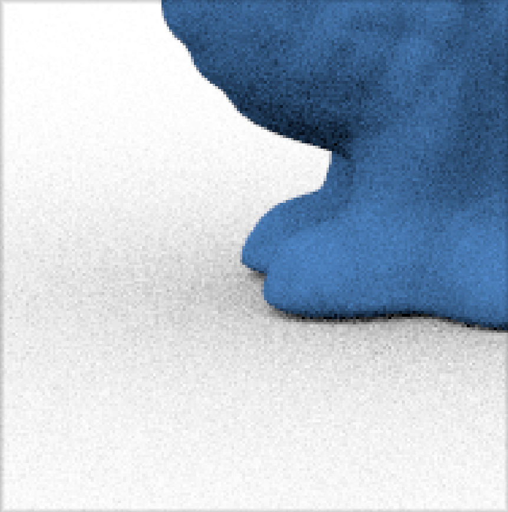
    <td>
</tr>
  <tr>
  <td align="center">Digit-permutated Halton Sampling</td>
  <td align="center">Owen-scrambled Halton Sampling</td>
</tr>
<tr>
    <td>
    <td>
</tr>
</table>

## Summary of Features
- [x] Camera Models
  - [x] Basic Perspective Camera
  - [x] Thinlens Camera
- [x] Basic Primitives
  - [x] Sphere
  - [x] Rectangles
  - [x] Triangle/Generic Meshes
- [x] Integrators
  - [x] Albedo
  - [x] Normals
  - [x] Direct Lighting
  - [x] Path Tracing 
- [x] BSDFs & Lighting Models:
  - [x] Materials: 
    - [x] Diffuse
    - [x] Conductor
    - [x] Rough Conductor
    - [x] Dielectric
    - [x] Principled
  - [x] Lambertian Emission
- [x] Textures:
  - [x] Checkerboard Texture
  - [x] Image Texture
- [x] Lights:
  - [x] Environment Map
    - [ ] Improved Environment Sampling
  - [x] Area Lights
    - [x] Uniform Sphere Sampling
    - [x] Cosine-Weighted Sampling
    - [x] Subtended-Cone Sampling  
  - [x] Point Light
  - [x] Directional Light
- [x] Sampling:
  - [x] BSDF Sampling 
  - [x] Next Event Estimation (NEE)
  - [x] Multiple Importance Sampling (MIS) 
- [x] Image denoising using [Intel&reg; Open Image Denoise](https://www.openimagedenoise.org/)
- [x] Acceleration Structures:
  - [x] SAH Bounding Volume Hierarchy
- [x] Shading Normals
- [x] Alpha Masking
- [x] Custom Bokeh Shapes

## Copyright & Credits
&copy; The Lightwave Framework was written by [Alexander Rath](https://graphics.cg.uni-saarland.de/people/rath.html), with contributions from [Ömercan Yazici](https://graphics.cg.uni-saarland.de/people/yazici.html) and [Philippe Weier](https://graphics.cg.uni-saarland.de/people/weier.html). Their support was invaluable in the coding of these features. The scenes showcasing the features were provided by their team, and should be used under permission. Many textures and models were taken from [Poly Haven](https://polyhaven.com.)'s extensive library.
                    
## References

<ol style="padding-left: 80px;">
  <li>Tomas Akenine-Mller, Eric Haines, and Naty Hoffman. <i>Real-Time Rendering</i> (4th ed.) USA: A. K. Peters, Ltd., 2018. ISBN: 0134997832. 
  <li>John F. Hughes et al. <i>Computer Graphics - Principles and Practice</i>, (3rd ed.) Addison-Wesley, 2014. ISBN: 978-0-321-39952-6.
  <li>Matt Pharr, Wenzel Jakob, and Greg Humphreys. <i>Physically Based Rendering: From Theory to Implementation</i>, (3rd ed.) Morgan Kaufmann Publishers Inc., 2016, ISBN: 978-0128006450.
  <li>Matt Pharr, Wenzel Jakob, and Greg Humphreys. <i>Physically Based Rendering: From Theory to Implementation</i>, (4th ed.) MIT Press, 2023, ISBN: 978-0262048026.</li>
</ol>
